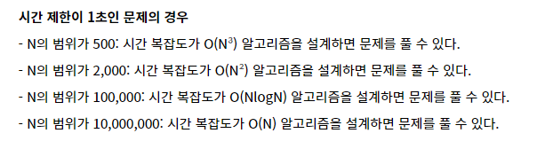

## 목차

1. 입/출력 처리 → **입출력 최적화**를 통해서 30%이상 개선 가능!
2.  SW 문제 해결
3. 알고리즘 성능 
    1. **시간 복잡도**: 수행시간(속도) → 빅오 표기법
    2. **공간 복잡도**: 메모리 사용량 → 스택 + heap + class → 내가 생성하는 객체가 얼마나 공간을 차지하는지 체크
4. 재귀 호출
5. 재귀 호출 - 피보나치 수열
6. 재귀 호출 응용 - 하노이 탑

# 입/출력 처리

## 표준 입출력

- `System.in` → 입력데이터 읽어 들임
- `System.out` → 결과데이터 출력
- `System.err`

## 표준 입출력의 대상변경

- `System.setOut()`
- `System.setErr()`
- `System.setIn()`  → `new FileInputStream(”tc.txt”)`

## java.util.Scanner

- 파일, 입력 스트림과 같은 다양한 입력 소스에서 데이터를 읽어 구분자로 토큰화하고 **다양한 타입으로 변환**하여 값을 리턴해주는 역할의 클래스
- 입력 스트림을 다루는 방법을 몰라도 손쉽게 입력처리 가능
- 데이터 형변환으로 인한 편리함
- **대량의 데이터 처리 시 수행시간이 비효율적임**

→ **데이터 형변환 많고 수행시간을 많이 고려하지 않을 경우 사용하면 좋다!**

- `Scanner(File source)`
- `Scanner(InputStream source)`
- `Scanner(String source)`

## 주요 메서드

| 메소드명 | 특징 |
| --- | --- |
| nextInt() | int 타입 반환
유효 문자열 후 White space 문자를 만나면 처리 |
| nextDouble() | double 타입 반환
유효 문자열 후 White space 문자를 만나면 처리 |
| next() | 문자열 반환
유효 문자열 후 White space문자를 만나면 처리 |
| nextLine() |  문자열 반환
개행(enter) 문자를 만나면 처리
next()와 달리 문자열 안에 띄어쓰기를 할 수 있음(space, tab을 포함할 수 있음) |

```java
String str = "123 
							123123"
next() -> nextLine() -> 공백 나옴 -> 조심해서 사용해야됨
```

## 여러 타입의 입력 시 주의

- 기존 입력의 white space가 다음 입력에 영향을 줄 수 있음

```java
public class IO1_ScannerTest {

	public static void main(String[] args) {

		Scanner sc = new Scanner(System.in);
		System.out.print("몇 기? : ");
		System.out.println("==> SSAFY : "+sc.nextInt());
		
		System.out.print("우리 기수를 나타내는 한마디 ? : ");
// sc.nextLine(); -> 해야됨
		System.out.print("==> 한마디 :"+sc.nextLine()+"!");
		
		sc.close();
	}
}
```


## java.io.BufferedReader

- 필터 스트림 유형
- 줄단위로 문자열 처리 기능 제공 → readLine()
- 대량의 데이터 처리 시 수행시간이 효율적임

```java
public class IO2_BufferedReaderTest {

	public static void main(String[] args) throws IOException {

		BufferedReader in = new BufferedReader(new InputStreamReader(System.in));
		String a = in.readLine();
		System.out.println(a);
		char[] ch = in.readLine().toCharArray();
		for (char c : ch) {
			System.out.println(c);
		}
		StringTokenizer st = new StringTokenizer(in.readLine(), " ");
		int i = Integer.parseInt(st.nextToken());
		int j = Integer.parseInt(st.nextToken());
		System.out.println(i+"//"+j);

	}

}
```

## java.lang.StringBuilder

- 문자열의 조작을 지원하는 클래스
- 자바에서 상수로 취급되는 문자열을 조작 시마다 새로운 문자열이 생성되는 것을 방지해줌 → 안쓰면 “hello” + “SSAFY” 할때마다 각각 String이 계속 생성된다.
- `append()`
- `toString()`

```java
public class IO3_StringBuilderTest {

	public static void main(String[] args) throws IOException {
		
		StringBuilder sb = new StringBuilder();
		sb.append("Hello ");
		sb.append("SSAFY").append("!!");
		System.out.println(sb.toString()); // Hello SSAFY!!
		
		sb.setLength(sb.length()-2);// -> 기존 길이 자르기
		System.out.println(sb.toString()); // Hello SSAFY
		
		sb.insert(0,"aaa "); // -> 인덱스에 String 추가
		System.out.println(sb.toString());
		
		sb.reverse(); // -> String 역순
		System.out.println(sb.toString());
	}

}
```

## 문제 해결 과정

1. 문제를 읽고 이해한다.
2. 문제를 익숙한 용어로 재정의한다.
3. 어떻게 해결할지 계획을 세운다. → 글 흐름, 계획 → 시간복잡도 확인
4. 계획을 검증한다.
5. 프로그램으로 구현한다.
6. 어떻게 풀었는지 돌아보고, 개선할 방법이 있는지 찾아본다. → **최소한 3개의 코드를 보기**

## 체계적인 접근을 위한 질문들

- 문제 해결 전략
    - 직관과 체계적인 접근
- 체계적인 접근을 위한 질문들
    - 비슷한 문제를 풀어본 적이 있던가?
    - **단순한 방법에서 시작할 수 있을까?**
    - 문제를 단순화 할 수 있을까?
    - 그림으로 그려 볼 수 있을까?
    - 수식으로 표현 할 수 있을까?
    - **문제를 분해 할 수 있을까?**
    - **뒤에서부터 생각해서 문제를 풀 수 있을까?**
    - 특정 형태의 답만을 고려할 수 있을까?

**정렬 → 순서가 상관이없다면 정렬해서 한번 생각해보기!**

- 무엇이 좋은 알고리즘인가?
    - **정확성 → 이게 제일 중요하다!**
    - 작업량
    - 메모리 사용량
    - 단순성
    - 최적성

- 요소 수가 증가함에 따라 각기 다른 시간복잡도의 알고리즘은 아래와 같은 연산 수를 보인다.
    
    
    
- **시간 복잡도 tip**
    
    
    

## 재귀 호출

- 반복과 재귀는 유사한 작업을 수행할 수 있다.
- 반복은 수행하는 작업이 완료될 때까지 계속 반복
    - 루프


- 재귀는 주어진 문제의 해를 구하기 위해 동일하면서 더 작은 문제의 해를 이용하는 방법
    - 하나의 큰 문제를 해결할 수 있는 (해결하기 쉬운) 더 작은 문제로 쪼개고 결과들을 결합한다.
    - 재귀 함수로 구현

## 재귀 함수

- 함수 내부에서 직접 혹은 간접적으로 자기 자신을 호출하는 함수.
- 일반적으로 재귀적 정의를 이용해서 재귀 함수를 구현한다.
- 따라서, 기본 부분와 유도 부분으로 구성된다.
- 재귀적 프로그램을 작성하는 것은 반복 구조에 비해 간결하고 이해하기 쉽다.
    - 그러나 재귀에 익숙하지 않은 개발자들은 재귀적 프로그램이 어렵다고 느낀다.
- 함수 호출은 프로그램 메모리 구조에서 스택을 사용한다.
- 따라서 재귀 호출은 반복적인 스택의 사용을 의미하며 메모리 및 속도에서 성능저하가 발생한다.

## 팩토리얼 재귀 함수

```java
public class R1_FactorialTest {
	
	private static int factorial1(int n) {
		int result = 1;
		for(int i = n; i > 0; i--) {
			result *= i;
		}
		
		return result;
	}
	
	private static int factorial2(int n) {
		if(n == 1) { // Basis part
			return 1;
		}
		return n * factorial2(n - 1); // Inductive part
	}
	
	public static void main(String[] args) {
		int result1 = factorial2(10);
		System.out.println(result1);
	}
}
```


## 반복 또는 재귀?

- 해결할 문제를 고려해서 반복이나 재귀의 방법을 선택
- 재귀는 문제 해결을 위한 알고리즘 설계가 간단하고 자연스럽다.
    - 추상 자료형의 알고리즘은 재귀적 구현이 간단하고 자연스러운 경우가 많다.
- 일반적으로, 재귀적 알고리즘은 반복 알고리즘보다 더 많은 메모리와 연산을 필요로 한다.
- 입력 값 n이 커질수록 재귀 알고리즘은 반복에 비해 비효율적일 수 있다.
    
    
    |  | 재귀 | 반복 |
    | --- | --- | --- |
    | 종료 | 재귀 함수 호출이 종료되는 베이스 케이스 | 반복문의 종료 조건 |
    | 수행 시간 | 느림 | 빠름 |
    | 메모리 공간 | 많이 사용 | 적게 사용 |
    | 소스 코드 길이 | 짧고 간결 | 길다 |
    | 소스 코드 형태 | 선택 구조 | 반복 구조 |
    | 무한 반복시 | 스택 오버플로우 | CPU를 반복해서 점유 |

## 하노이 탑 문제

- 하노이 탑 게임은 세 개의 기둥과 서로 다른 크기의 N개의 원판으로 구성된다.
- 원판을 세 번째로 모두 옮겨 놓아야 한다.
- 원판을 옮길 때는 반드시 한 번에 한 개씩 옮길 수 있고 두 번째 기둥을 이용할 수 있다.
- 옮기는 과정에서 절대로 큰 원판이 작은 원판 위에 놓이지 않아야 한다.
    
    
    

- 제약사항
    - 원판 번호는 맨 위부터 1,2,3 순으로 부여
    - 기둥은 3개로 가정한다.
    - 시작은 N개의 원판이 1번 기둥에 쌓여져 있다.
- 입력
    - 원판 개수인 N을 입력 받는다.
    - 원판 번호는 맨 위부터 1,2,3 순으로 부여
- 출력
    - 옮겨지는 원판 번호 : 출발기둥번호 → 목적기둥번호