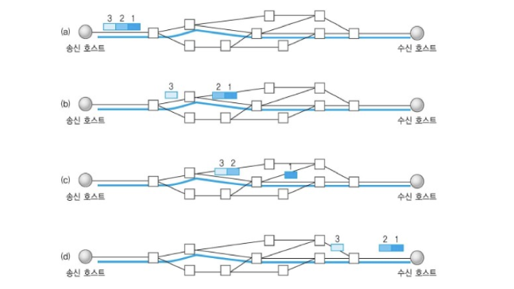
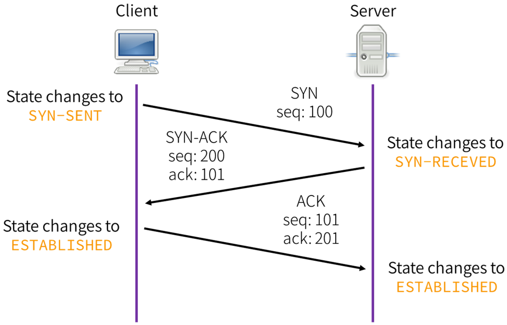

## TCP (Transmission Control Protocol)
인터넷상에서 데이터를 메세지의 형태로 보내기 위해 IP와 사용하는 프로토콜   

TCP는 애플리케이션에게 **신뢰적이고 연결지향성** 서비스를 제공한다.   
일반적으로 TCP와 IP는 함께 사용되며 **IP는 배달을, TCP는 패킷의 추적 및 관리를 한다.**

TCP는 연결형 서비스로, 신뢰적인 전송을 보장하기에 handshake하고 데이터의 흐름제어와 혼잡제어를 수행한다. -> **이로 인해 TCP 속도는 UDP보다 느리다.**

* TCP 특징
    - 3-Way HandShaking 과정을 통해 연결을 설정하고 4-Way HandShake을 통해 연결 해제를 한다.
    - 흐름 제어 및 혼잡 제어.
    - 높은 신뢰성
    - UDP 보다 속도가 느리다.
    - 전이중, 점대점 방식.
    - 가상회선 패킷 교환 방식을 사용한다.

### 가상 회선 패킷 교환 방식

* 각 패킷에는 가상회선 식별자가 포함되며 모든 패킷을 전송하면 가상회선이 해제되고 패킷들은 전송된  **순서대로 도착하는** 방식

## 1. 3-Way HandShake (TCP 연결)

TCP는 장치들 사이에 논리적인 접속을 성립하기 위해 3 Way HandShake를 사용한다.   
이러한 절차는 TCP 접속을 성공적으로 성립하기 위해 반드시 필요하다.

1. `SYN 단계` : 클라이언트는 서버에 클라이언트의 `ISN`을 담아 `SYN`을 보낸다.
    - **ISN** : 새로운 TCP 연결의 첫 번째 패킷에 할당된 임의의 시퀀스 번호를 말한다. (위 그림에서는 100)
2. `SYN + ACK 단계` : 서버는 클라이언트의 `SYN`을 수신하고 서버의 `ISN(200)` 과 `ACK`(승인번호) 로 클라이언트의 `ISN + 1` 을 보낸다.
3. `ACK 단계` : 클라이언트는 서버의 `ISN + 1` 한 값인 승인번호를 받아서 `ACK`를 서버에 보낸다.
