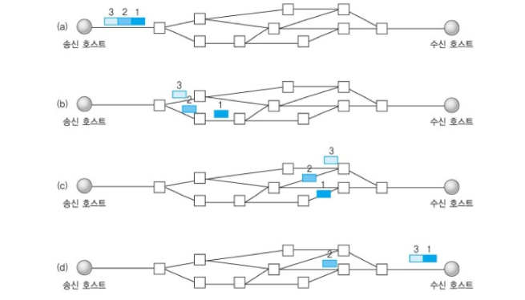

## 1. UDP (User Datagram Protocol)
비연결형, 신뢰성이 없는 전송 프로토콜이다.
* ### 전송 방법
    - IP 데이터그램을 캡슐화하여 보내는 방법
    - 연결 설정 하지 않고 보내는 방법

* ### UDP의 특징
    * UDP는 흐름제어, 오류제어 또는 손상된 세그먼트의 수신에 대한 재전송을 하지 않는다.

    * 내용이 전송 중에 손실 될 수 있고, 전송되는 세그먼트의 순서가 바뀔 수 있다.

    * 이러한 특징 때문에 TCP보다 간단하고 빠른 장점을 가지고 있다.

    * 수신자와 송신자 간의 handshake가 없는 비연결성 성질을 가진다.

    * 데이터 그램 패킷 교환 방식을 사용한다.

* ### 데이터그램 패킷 교환 방식
    
    - 패킷이 독립적으로 이동하며 최적의 경로를 선택하여 간다.
    - 하나의 메시지에서 분할된 여러 패킷은 서로 다른 경로로 전송될 수 있으며 도착한 **순서가 다를 수 있는 방식**

## 2. TCP와 UDP는 왜 나오게 됐는가?

  1. `IP`의 역할은 `Host to Host` (장치 to 장치)만을 지원한다. 장치에서 장치로 이동은 `IP`로 해결되지만, 하나의 장비안에서 수많은 프로그램들이 통신을 할 경우에는 `IP`만으로는 한계가 있다.

  2. 또한, `IP`에서 오류가 발생한다면 `ICMP`에서 알려준다. 하지만 ICMP는 알려주기만 할 뿐 대처를 못하기 때문에 IP보다 위에서 처리를 해줘야 한다.

  - **1번을 해결하기 위하여 포트 번호가 나오게 됐고, 2번을 해결하기 위해 상위 프로토콜인 TCP와 UDP가 나오게 되었다.**

  * `ICMP` : 인터넷 제어 메시지 프로토콜로 네트워크 컴퓨터 위에서 돌아가는 운영체제에서 오류 메시지를 전송받는데 주로 쓰임

## 3. UDP를 사용하는 이유

UDP는 TCP와 다르게 흐름제어나 오류제어가 필요가없다. 즉 전송 속도를 최대한 빠르게 할 수 있다.  
TCP 처럼의 신뢰성있는 전송을 보장 못하기 때문에**신뢰성보다 속도가 더 중요한 부문에서 UDP를 사용한다.**

예를 들어 유튜브 스트리밍은 신뢰성보다 속도가 더 중요하므로 UDP를 사용한다.
(WebRTC 프로토콜 또한 UDP를 토대로 만든 프로토콜이다., DNS와 SNMP또한 UDP를 사용한다.)

- DNS(Domain Name System)에서 UDP를 사용하는 이유!

  - Request의 양이 작음 -> UDP Request에 담길 수 있다.
  - 3 way handshaking으로 연결을 유지할 필요가 없다. (오버헤드 발생)
  - Request에 대한 손실은 Application Layer에서 제어가 가능하다.
  - DNS : port 53번
  - But, TCP를 사용할 때가 있다! 크기가 512(UDP 제한)이 넘을 때, TCP를 사용해야한다.


## 4. UDP checksum


UDP segment header에 보면 checksum 이라는 항목이 존재 -> segment의 에러를 탐지하기 위해 존재  

* ### checksum의 계산 방법
    - 도착 IP주소, 송신 포트번호, 수신 포트번호, 데이터 길이, payload 등의 데이터들을 16비트 단위로 쪼개서 전부 더한다.
        ```
        c0ff+ff32+c0ff+ff32+0011+000c+a45c+270f+000c+7465+7374 = 0x533d0
        ```

    - 만약 더하는 도중 overflow되서 carry-out된 값이 있다면 결과에 다시 더해서 sum 값을 만든다.
        ```
        0x533d0 -> 33d0 + 5 = 33d5
        ```

    - 계산한 sum 값을 1의 보수를 취하면 checksum 값이 된다.   
        ```
        0011 0011 1101 0101 = 33d5
        1100 1100 0010 1010 = cc2a
        ```
    
    > 이렇게 계산한 checksum 값을 송신측에서 checksum영역에 넣어서 수신측에 보내면 수신측도 마찬가지로 sum을 구하고 송신측에서 보낸 checksum과 동일한지 확인한다.   
    만약 동일하다면 에러가 없는 것이고 동일하지 않다면 에러가 있다는 것을 확인할 수 있다.  

    

